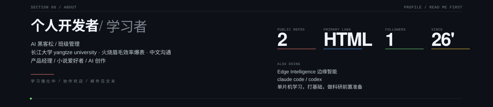

<!-- ─────────────────────────────────────────────────────────────── -->
<!--  CHENG-PRO · individual developer · learning & building          -->
<!--  Optimized for GitHub Dark Mode                                 -->
<!-- ─────────────────────────────────────────────────────────────── -->

<a href="https://chasen.cn/">
  
</a>

<br/>





<p align="left">
  <sub><code>ALSO ON GITHUB</code>&nbsp;&nbsp;<a href="https://github.com/CHENG-pro/talent-role-fit-assessor">talent-role-fit-assessor</a>&nbsp; ·&nbsp; <a href="https://github.com/CHENG-pro/my-ai-agency-demo">my-ai-agency-demo</a></sub>
</p>

<p align="left">
  <sub><code>PRINCIPLES</code>&nbsp;&nbsp;learning by doing&nbsp; ·&nbsp; ship narrow, ship done&nbsp; ·&nbsp; source &gt; docs&nbsp; ·&nbsp; stay curious</sub>
</p>


<!-- metrics - two cards, self-hosted, regenerated daily 03:17 +08 via GitHub Actions -->
<div align="center">
  
  
</div>

<br/>

<picture>
  <source media="(prefers-color-scheme: dark)" srcset="https://raw.githubusercontent.com/CHENG-pro/CHENG-pro/output/github-contribution-grid-snake-dark.svg" />
  <source media="(prefers-color-scheme: light)" srcset="https://raw.githubusercontent.com/CHENG-pro/CHENG-pro/output/github-contribution-grid-snake.svg" />
  
</picture>


<!-- contact -->

```
WEB      https://chasen.cn
GITHUB   https://github.com/CHENG-pro
EMAIL    chengshuai6755@gmail.com
```


